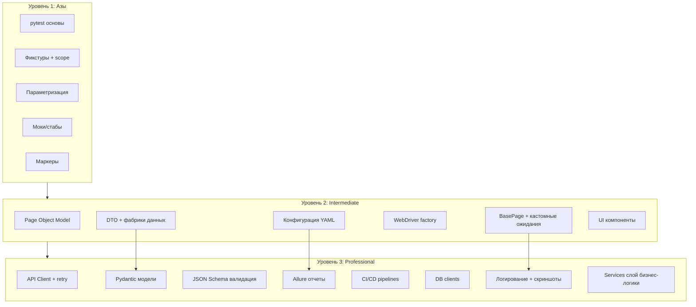

# 🐍 FULL_PYTHON — План проекта

## Общая структура

```
FULL_PYTHON/
├── python_basics/                  # Курс Python с нуля (32 урока)
├── test_automation_framework/      # Фреймворк автоматизации тестирования
└── plans/
    └── master_plan.md
```

---

## 📁 Часть 1: `python_basics/` — Полный курс Python (32 урока)

Каждый урок содержит:
- `README.md` — теория с объяснениями на русском языке
- `.py` файлы с кодом и подробными комментариями
- Упражнения для самостоятельной работы

### Уроки:

| # | Директория | Тема |
|---|-----------|------|
| 01 | `01_hello_world/` | Установка Python, первая программа, `print()`, `input()`, комментарии |
| 02 | `02_variables_and_types/` | Переменные, типы данных (`int`, `float`, `str`, `bool`), `type()`, приведение типов |
| 03 | `03_strings/` | Строки: индексация, срезы, методы `.upper()`, `.lower()`, `.split()`, `.join()`, f-строки |
| 04 | `04_operators/` | Арифметические, сравнения, логические, побитовые, `is`, `in` |
| 05 | `05_conditions/` | `if` / `elif` / `else`, тернарный оператор, `match/case` (Python 3.10+) |
| 06 | `06_loops/` | `for`, `while`, `range()`, `enumerate()`, `zip()`, `break` / `continue` / `pass` |
| 07 | `07_lists/` | Списки: создание, методы, срезы, сортировка, копирование (shallow vs deep) |
| 08 | `08_tuples_sets/` | Кортежи (неизменяемость, распаковка), множества (уникальность, операции) |
| 09 | `09_dictionaries/` | Словари: создание, методы, dict comprehensions, `defaultdict`, `Counter` |
| 10 | `10_functions/` | Функции: `def`, аргументы (позиционные, именованные, `*args`, `**kwargs`), `return`, область видимости |
| 11 | `11_lambda_builtins/` | `lambda`, `map()`, `filter()`, `reduce()`, `sorted()`, `any()` / `all()` |
| 12 | `12_modules_packages/` | Импорты, `__name__ == "__main__"`, создание пакетов, `pip` |
| 13 | `13_exceptions/` | `try/except/else/finally`, `raise`, свои исключения, `with` (контекстные менеджеры) |
| 14 | `14_files/` | Открытие/закрытие, режимы (`r`, `w`, `a`, `rb`), `Path` из `pathlib`, `csv`, `json` |
| 15 | `15_oop_basics/` | Классы, `__init__`, `self`, методы экземпляра, атрибуты, `__str__`, `__repr__` |
| 16 | `16_oop_inheritance/` | Наследование, `super()`, множественное наследование, MRO, переопределение методов |
| 17 | `17_oop_magic_methods/` | `__len__`, `__getitem__`, `__iter__`, `__enter__`/`__exit__`, `__call__`, `__eq__` |
| 18 | `18_oop_properties/` | `@property`, `@setter`, `@deleter`, инкапсуляция, `@classmethod`, `@staticmethod` |
| 19 | `19_decorators/` | Замыкания, декораторы функций, декораторы с аргументами, `functools.wraps` |
| 20 | `20_generators_iterators/` | Итераторы (`__iter__`, `__next__`), генераторы (`yield`), `yield from`, генераторные выражения |
| 21 | `21_comprehensions/` | List/dict/set comprehensions, вложенные, с условиями |
| 22 | `22_dates_and_times/` | `datetime`, `date`, `time`, `timedelta`, форматирование (`strftime`/`strptime`), `timezone` |
| 23 | `23_json_csv/` | `json` (dump, load, dumps, loads), `csv` (reader, writer, DictReader/Writer), работа с API-ответами |
| 24 | `24_regex/` | `re` модуль: `search`, `match`, `findall`, `sub`, группы, паттерны |
| 25 | `25_virtual_env/` | `venv`, `pip freeze`, `requirements.txt`, структура проекта Python |
| 26 | `26_type_hints/` | Аннотации типов, `typing` (List, Dict, Optional, Union), `mypy`, `dataclasses` |
| 27 | `27_testing_basics/` | `unittest` / `pytest`: утверждения, фикстуры, parametrize, моки |
| 28 | `28_concurrency/` | Потоки (`threading`), процессы (`multiprocessing`), `asyncio` (async/await) |
| 29 | `29_logging/` | Модуль `logging`: уровни, handlers, formatters, логирование в файл |
| 30 | `30_final_project/` | Итоговый мини-проект (консольное приложение, объединяющее все знания) |
| 31 | `31_sqlite/` | SQLite: `sqlite3`, создание БД, таблицы, CRUD, SELECT с JOIN, транзакции, RowFactory |
| 32 | `32_postgresql/` | PostgreSQL: установка, `psycopg2`, подключение, параметризованные запросы, connection pool, миграции |

---

## 📁 Часть 2: `test_automation_framework/` — Фреймворк автоматизации тестирования

### Уровень 1: `01_basics/` — Азы тестирования

```
01_basics/
├── README.md                       # Теория тестирования: виды, пирамида, терминология
├── pytest.ini                      # Конфигурация pytest
├── conftest.py                     # Общие фикстуры
├── test_examples/
│   ├── test_simple.py              # Простейшие тесты, assert
│   ├── test_fixtures.py            # Фикстуры: setup/teardown, scope, yield
│   ├── test_parametrize.py         # Параметризация тестов
│   ├── test_markers.py             # Маркеры: skip, xfail, custom markers
│   ├── test_exceptions.py          # Проверка исключений (pytest.raises)
│   └── test_mock.py                # Основы мокирования (unittest.mock)
└── utils/
    ├── calculator.py               # Тестируемое приложение-калькулятор
    └── helpers.py                  # Вспомогательные функции
```

### Уровень 2: `02_intermediate/` — Page Object, DTO, паттерны

```
02_intermediate/
├── README.md                       # Теория: паттерны в автотестировании
├── conftest.py                     # Фикстуры для WebDriver, браузеров
├── pytest.ini
├── config/
│   ├── config.yaml                 # Конфигурация (урлы, браузеры)
│   └── config_manager.py           # Загрузчик конфигурации
├── drivers/                         # WebDriver'ы (chromedriver и т.д.)
├── pages/                           # Page Object Model
│   ├── base_page.py                # Базовый класс страницы
│   ├── login_page.py               # Страница логина
│   ├── inventory_page.py           # Страница товаров
│   ├── cart_page.py                # Корзина
│   └── checkout_page.py            # Оформление заказа
├── components/                      # Переиспользуемые UI-компоненты
│   ├── header.py                   # Шапка сайта
│   └── footer.py                   # Подвал сайта
├── dto/                             # Data Transfer Objects
│   ├── user_dto.py                 # DTO пользователя
│   ├── product_dto.py              # DTO товара
│   └── order_dto.py                # DTO заказа
├── factories/                       # Фабрики тестовых данных
│   ├── user_factory.py
│   └── product_factory.py
├── tests/
│   ├── test_login.py               # Тесты логина
│   ├── test_inventory.py           # Тесты каталога
│   ├── test_cart.py                # Тесты корзины
│   └── test_checkout.py            # E2E сценарий покупки
├── utils/
│   ├── driver_factory.py           # Фабрика WebDriver (Chrome, Firefox)
│   ├── wait_helpers.py             # Кастомные ожидания
│   └── screenshot.py               # Скриншоты при падении
└── data/
    └── test_data.json              # Тестовые данные
```

### Уровень 3: `03_professional/` — Профессиональный фреймворк

```
03_professional/
├── README.md                       # Архитектура фреймворка
├── requirements.txt                # Все зависимости
├── Makefile                        # Команды запуска
├── conftest.py                     # Глобальные фикстуры и хуки
├── pytest.ini                      # Настройки: allure, markers, logging
├── config/
│   ├── settings.yaml               # Все настройки проекта
│   ├── config_manager.py           # Singleton ConfigManager
│   └── browsers.json               # Конфигурация браузеров
├── common/                          # Общие компоненты
│   ├── logger.py                   # Логирование
│   ├── api_client.py               # HTTP клиент (requests + retry)
│   ├── allure_helper.py            # Вложения в Allure
│   └── assertion_helpers.py        # Кастомные ассерты
├── web/                             # Web-тестирование
│   ├── pages/
│   │   ├── base_page.py            # Улучшенный BasePage (ожидания, JS, скриншоты)
│   │   └── ...
│   ├── components/
│   │   ├── base_component.py
│   │   └── ...
│   ├── services/                    # Бизнес-логика (шаги сценариев)
│   │   ├── login_service.py
│   │   └── checkout_service.py
│   ├── tests/
│   │   ├── smoke/                  # Smoke-тесты
│   │   ├── regression/             # Регрессионные тесты
│   │   └── e2e/                    # End-to-end
│   └── drivers/
│       └── driver_manager.py       # Автоматическая загрузка драйверов
├── api/                             # API-тестирование
│   ├── clients/
│   │   ├── base_client.py          # Базовый API клиент
│   │   ├── auth_client.py          # Клиент авторизации
│   │   ├── user_client.py          # CRUD пользователей
│   │   └── product_client.py       # Работа с продуктами
│   ├── models/                      # Pydantic-модели (сериализация/валидация)
│   │   ├── base_model.py
│   │   ├── user_model.py
│   │   ├── product_model.py
│   │   └── error_model.py
│   ├── schemas/                     # JSON Schema для валидации контрактов
│   │   ├── user_schema.json
│   │   └── product_schema.json
│   ├── services/                    # Бизнес-логика API
│   │   ├── user_service.py
│   │   └── product_service.py
│   └── tests/
│       ├── test_auth_api.py
│       ├── test_users_api.py
│       └── test_products_api.py
├── data/                            # Тестовые данные
│   ├── sql/
│   │   └── seed_data.sql
│   ├── test_data.json
│   └── factories/
│       ├── base_factory.py         # Factory Boy интеграция
│       └── fixtures.py
├── db/                              # Работа с БД
│   ├── db_client.py
│   └── queries.py
├── reports/                         # Allure-отчеты
│   └── .gitkeep
├── docker/                           # Docker и Selenoid
│   ├── Dockerfile                    # Образ для запуска тестов
│   ├── docker-compose.yml            # Selenoid + Selenoid UI + тестовый контейнер
│   ├── browsers.json                 # Конфигурация браузеров для Selenoid
│   └── .env                          # Переменные окружения для Docker
├── ci/                              # CI/CD
│   ├── Jenkinsfile
│   └── .github/workflows/
│       └── tests.yml
└── scripts/
    ├── run_web_tests.sh
    ├── run_api_tests.sh
    └── generate_report.sh
```

---

## 🎯 Итоговый план действий

1. Создать все 30 уроков `python_basics/` (каждый с README.md и кодом)
2. Создать `test_automation_framework/01_basics/` — основы pytest
3. Создать `test_automation_framework/02_intermediate/` — Page Object + DTO
4. Создать `test_automation_framework/03_professional/` — профессиональный фреймворк

---

## 📊 Диаграмма архитектуры тестового фреймворка



---

## 🔑 Ключевые концепции, покрываемые проектом

### Python Basics:
- Все основные конструкции языка
- ООП (инкапсуляция, наследование, полиморфизм)
- Функциональное программирование
- Работа с данными (JSON, CSV, БД)
- Асинхронность
- Type hints
- Логирование
- Тестирование кода

### Test Automation Framework:
- Пирамида тестирования
- Pytest (фикстуры, параметризация, хуки)
- Page Object Model
- Data Transfer Objects (DTO)
- Factory Boy (генерация тестовых данных)
- Selenium WebDriver
- API тестирование с `requests`/`httpx`
- Контрактное тестирование (JSON Schema)
- Allure-отчетность
- CI/CD (GitHub Actions, Jenkins)
